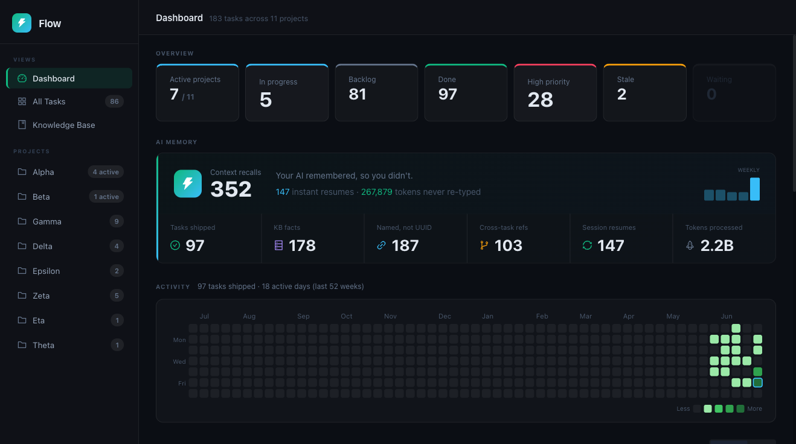
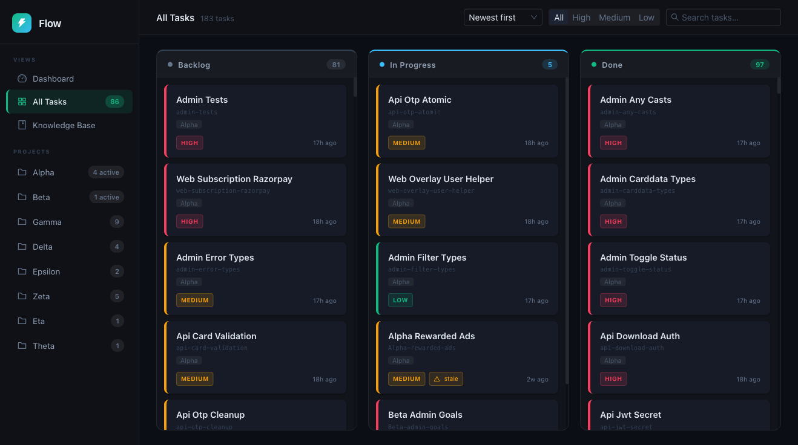
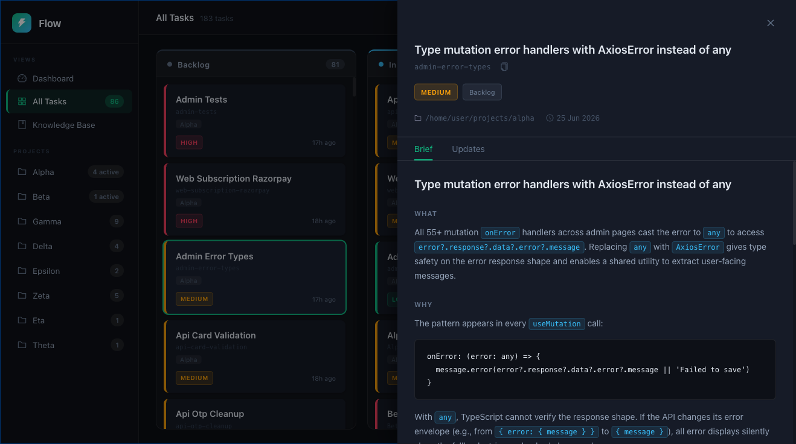

# flow-ui

A local web dashboard for the [flow](https://github.com/Facets-cloud/flow) CLI — visualise your tasks, projects, knowledge base, and throughput in a browser.

flow is a personal task and session manager for developers. flow-ui gives it a visual layer: kanban boards, throughput charts, a GitHub-style activity heatmap, and a knowledge base reader — all reading directly from your local `~/.flow` data, with no external services.

---

## Screenshots

**Dashboard** — overview stats, AI memory metrics, activity heatmap



**Tasks** — kanban board with priority, stale, and waiting-on badges



**Task detail** — brief and update history in a slide-in drawer



---

## Install

Download the binary for your platform from the [latest release](https://github.com/hoctechlabs/flow-ui/releases/latest). No Node or Go required — the frontend is embedded in the binary.

### macOS (Apple Silicon)
```bash
curl -L https://github.com/hoctechlabs/flow-ui/releases/latest/download/flow-ui-darwin-arm64 -o flow-ui
chmod +x flow-ui
./flow-ui
```

### macOS (Intel)
```bash
curl -L https://github.com/hoctechlabs/flow-ui/releases/latest/download/flow-ui-darwin-amd64 -o flow-ui
chmod +x flow-ui
./flow-ui
```

Then open [http://localhost:8765](http://localhost:8765) in your browser.

**Requires:** [flow CLI](https://github.com/Facets-cloud/flow) installed and initialised (`flow init`). flow is macOS-only.

---

## Running from source

**Prerequisites:** Go 1.21+, Node.js 18+, flow CLI

```bash
# Install frontend dependencies (first time only)
npm install

# Start both the API server (:8765) and the Vite dev server (:5173)
npm start
```

Then open [http://localhost:5173](http://localhost:5173).

---

## How releases work

Releases are built automatically by GitHub Actions when a version tag is pushed.

### Triggering a release

```bash
git tag v1.0.0
git push origin v1.0.0
```

That's it. The workflow does the rest.

### What the workflow does

```
1. Build frontend
   npm ci
   vite build --outDir server/dist
   → Produces static assets in server/dist/

2. Embed frontend into Go binary
   go build -tags release ...
   → The 'release' build tag activates embed_release.go, which uses
     Go's embed package to bundle server/dist/ into the binary.
     The dev build (go run) uses embed_dev.go instead — a no-op stub
     that skips the embed, so no dist/ directory is needed locally.

3. Compile for macOS (matches the platforms flow CLI supports)
   darwin/arm64   → flow-ui-darwin-arm64
   darwin/amd64   → flow-ui-darwin-amd64

4. Create GitHub release
   Attaches all 5 binaries.
   Generates release notes from commit messages.
   Includes install instructions in the release body.
```

### What the released binary does

The released binary is a single self-contained executable. When run, it:

- Serves the embedded React frontend at `http://localhost:8765/`
- Serves the REST API at `http://localhost:8765/api/...`
- Reads from `~/.flow/` (or `$FLOW_ROOT` if set)
- Calls the `flow` CLI for data that isn't directly in the SQLite DB

Frontend and API share the same origin (port 8765), so no CORS is needed in production. In dev mode, the Vite server runs on 5173 and proxies `/api` to 8765, which is why CORS is still enabled in the Go server.

### Build tags

| Tag | File | Effect |
|---|---|---|
| *(default)* | `embed_dev.go` | No embed; frontend served by Vite on :5173 |
| `release` | `embed_release.go` | Embeds `server/dist/` into binary; serves on :8765 |

---

## API endpoints

| Endpoint | Description |
|---|---|
| `GET /api/projects` | All projects with task counts |
| `GET /api/tasks` | Tasks (`?status=`, `?project=`, `?priority=`) |
| `GET /api/tasks/:slug` | Task detail with brief and update history |
| `GET /api/throughput` | Tasks created vs closed (`?granularity=day\|week&project=<slug>`) |
| `GET /api/activity` | Daily task completions for the last 52 weeks |
| `GET /api/stats` | flow session and memory stats |
| `GET /api/kb/all` | All knowledge base files |

---

## Tech stack

**Frontend:** React 19 + TypeScript, Vite, Ant Design v6, TanStack Query, Axios, @ant-design/charts

**Backend:** Go — single file (`server/main.go`), `modernc.org/sqlite` (no CGo required)

---

## Configuration

| Variable | Default | Description |
|---|---|---|
| `FLOW_ROOT` | `~/.flow` | Path to your flow data directory |

---

## Security note

flow-ui has **no authentication**. It is designed for local-only use and should not be exposed on a public network. The server reads from your `~/.flow` directory which may contain personal and organisation-sensitive information.

---

## Contributing

Bug reports, feature requests, and PRs are welcome. See [CONTRIBUTING.md](CONTRIBUTING.md) for guidelines.

## License

MIT
